# Human-centric Code Complexity (HCC) Metrics Calculator

This replication package contains the source code and data used in the paper *"The Impact of Understandability on Defect-inducing Risks of Software Changes"* and the implementation of the human-centric code complexity (HCC) metrics calculator, `hcc_cal`.

## Table of Contents

- [Human-centric Code Complexity (HCC) Metrics Calculator](#human-centric-code-complexity-hcc-metrics-calculator)
  - [Table of Contents](#table-of-contents)
- [`hcc_cal`](#hcc_cal)
  - [Structure](#structure)
  - [Pre-requisites](#pre-requisites)
  - [Installation](#installation)
  - [Building from Source](#building-from-source)
- [The Replication Package](#the-replication-package)
  - [0. Setup](#0-setup)
  - [1. Building Dataset](#1-building-dataset)
    - [1) Collecting the Changes and Contexts](#1-collecting-the-changes-and-contexts)
      - [(Option 1) From Scratch](#option-1-from-scratch)
      - [(Option 2) From Pre-filtered Commits](#option-2-from-pre-filtered-commits)
    - [2) Computing HCC Metrics](#2-computing-hcc-metrics)
  - [2. Reproducing the Results](#2-reproducing-the-results)
    - [Pre-analysis](#pre-analysis)
    - [RQ1: Do HCC metrics correlate with defect-inducing risk?](#rq1-do-hcc-metrics-correlate-with-defect-inducing-risk)
    - [RQ2: How do HCC metrics differ from existing JIT-SDP metrics?](#rq2-how-do-hcc-metrics-differ-from-existing-jit-sdp-metrics)
    - [RQ3: Can HCC metrics improve the performance of JIT-SDP models?](#rq3-can-hcc-metrics-improve-the-performance-of-jit-sdp-models)
    - [Discussion: More Actionable JIT-SDP with HCC metrics](#discussion-more-actionable-jit-sdp-with-hcc-metrics)

# `hcc_cal`

`hcc_cal` is a python package that calculates the human-centric code complexity (HCC) of a commit.

We provide `hcc_cal` as a standalone package for collecting commits with modified methods and calculating the HCC metrics.

## Structure

```bash
 src/hcc_cal
 ├── commit.py # The core module that contains the classes for the commit and its changes.
 ├── hcc
 │  ├── __init__.py
 │  ├── cfg.py
 │  ├── halstead.py
 │  ├── metrics.py # The module that calculates the HCC metrics.
 │  └── rii.py
 └── tools
    ├── __init__.py
    ├── correlation.py # The module that calculates the correlation
    └── data_utils.py # The module that processes the data for JIT-SDP.
```

## Pre-requisites

- python 3.10+
- pip
- wheel

## Installation

Currently, you can install `hcc_cal` via a .whl file. Download [hcc_cal-0.1.0-py3-none-any.whl](dist/hcc_cal-0.1.0-py3-none-any.whl) to your project and install it using pip wheel.

```bash
$ pip install hcc_cal-0.1.0-py3-none-any.whl
```

We will provide the package via PyPI in the future.

## Building from Source

Also, you can build the package from the source code via `rye`.

```bash
$ rye build --clean --wheel
```

# The Replication Package

This repository includes all the scripts, data and trained models to reproduce the results of the paper. The replication package is structured as follows:

```bash
├── data
│  ├── dataset # see `Building Dataset`
│  ├── output # generated output from `jit_sdp.py`
│  ├── plots # generated plots
│  └── archives # zipped trained models (pickles) in our experiment
├── dist # hcc_cal wheel file
├── hcc_cal # hcc_cal source code, see `hcc_cal`
└── scripts # scripts for reproducing the results
```


## 0. Setup

- [rye](https://rye-up.com): We recommend to use `rye`, a hassle-free python package manager. After installing rye, run the following command to install all dependencies for the replication and `hcc_cal`.

    ```bash
    $ rye pin 3.12 # pin the python version you want to use
    $ rye sync # install all dependencies
    ```

    See [pyproject.toml](./pyproject.toml) for the list of dependencies.
- [Checkstyle](https://github.com/checkstyle/checkstyle/releases/): Save to root directory as checkstyle.jar for easy replication. For example,

    ```bash
    $ wget https://github.com/checkstyle/checkstyle/releases/download/checkstyle-10.15.0/checkstyle-10.15.0-all.jar -O checkstyle.jar
    ```
- trained models: unzip the pickles.zip in the `data/archives` directory

    ```bash
    $ zip -s 0 data/archives/pickles.zip --out data/pickles.zip
    $ unzip data/pickles.zip -d data/pickles
    ```

## 1. Building Dataset

To calculate the verification latency gap (i.e., average fixing time, gap), we slightly modified the code of the [ApacheJIT](https://github.com/hosseinkshvrz/apachejit) repository to create an apachejit dataset that includes a fixed_date, and constructed `data/dataset/apachejit_gap.csv`, which is composed of a total of 8 projects that include the gap.

Then, we calculated the HCC of the ApacheJIT commits using the `hcc_cal` package. Additionally, we calculated the `LT` for the ApacheJIT commits because the `LT` is a widely used metric in the literature.

```bash
data/dataset
├── apache_metrics_kamei.csv
├── apachejit_date.csv
├── apachejit_gap.csv
├── baseline  # LT added apachejit dataset (baseline)
│  ├── activemq.csv
│  ├── camel.csv
│  ├── ...
├── baseline.csv
├── commits   # Filtered commits
│  ├── activemq.csv
│  ├── ...
└── hcc   # HCC dataset
   ├── ...
```

### 1) Collecting the Changes and Contexts

```bash
$ python scripts/collect.py --help

 Usage: collect.py [OPTIONS] COMMAND [ARGS]...
╭─ Commands ───────────────────────────────────────────────────────────────────────────────────────────────╮
│ change-contexts            Save the change contexts for commits that modified existing methods           │
│ changes-and-contexts       Filter and collect change contexts for commits that modified existing methods │
│ prepare-data               Generate the gap added column in the apachejit dataset                        │
╰──────────────────────────────────────────────────────────────────────────────────────────────────────────╯
```

#### (Option 1) From Scratch

To build the dataset from scratch (i.e., from `data/dataset/apachejit_date.csv`, which is the `fixed_date` added version`apachejit_total.csv` of ApacheJIT),

```bash
 Usage: collect.py prepare-data [OPTIONS]

 Generate the gap added column in the apachejit dataset

╭─ Options ─────────────────────────────────────────────────────────────────────────╮
│ --dataset-dir        PATH  Path to the dataset directory [default: data/dataset]  │
╰───────────────────────────────────────────────────────────────────────────────────╯
```

Then, to filter the commits that modified only existing methods (i.e., our target software changes) and collect corresponding modified methods (i.e., change contexts),

```bash
 Usage: collect.py changes-and-contexts [OPTIONS] PROJECT

 Filter and collect change contexts for commits that modified existing methods

╭─ Arguments ────────────────────────────────────────────────────────────────────────────────────────────────╮
│ *    project      TEXT  activemq|camel|cassandra|flink|groovy|hbase|hive|ignite [default: None] [required] │
╰────────────────────────────────────────────────────────────────────────────────────────────────────────────╯
╭─ Options ──────────────────────────────────────────────────────────────────────────────────────────────────╮
│ --apachejit        TEXT  Path to ApacheJIT dataset [default: data/dataset/apachejit_gap.csv]               │
│ --commits-dir        PATH  Path to the commits directory [default: data/dataset/commits]                   │
╰────────────────────────────────────────────────────────────────────────────────────────────────────────────╯
```

#### (Option 2) From Pre-filtered Commits

Or to save the change contexts for all commits that modified existing methods with pre-filtered commits (i.e., `data/dataset/commits`)

```bash
 Usage: collect.py change-contexts [OPTIONS] PROJECT

 Save the change contexts for commits that modified existing methods

╭─ Arguments ───────────────────────────────────────────────────────────────────────────────╮
│ *    project      TEXT  [default: None] [required]                                        │
╰───────────────────────────────────────────────────────────────────────────────────────────╯
╭─ Options ─────────────────────────────────────────────────────────────────────────────────╮
│ --commits-dir        PATH  Path to the commits directory [default: data/dataset/commits]  │
│ --help                     Show this message and exit.                                    │
╰───────────────────────────────────────────────────────────────────────────────────────────╯
```

`hcc_cal.commit.MethodChangesCommit` instances are saved to `data/cache/<project>/<commit_hash>.pkl`.

### 2) Computing HCC Metrics

```bash
$ python scripts/compute.py hcc --help

 Usage: compute.py [OPTIONS] COMMAND [ARGS]...

╭─ Commands ──────────────────────────────────────────────────────╮
│ hcc                 Compute specific HCC metrics for a project  │
│ hcc-all             Compute all HCC metrics for a project       │
│ lt                  Compute LT for apachejit_metrics            │
╰─────────────────────────────────────────────────────────────────╯
```

To compute the HCC metrics from the saved changes and its contexts (i.e., `MethodChangesCommit` instances),

```bash
 Usage: compute.py hcc-all [OPTIONS] PROJECT

 Compute all HCC metrics for a project

╭─ Arguments ────────────────────────────────────────────────────────────────────────────────────────────────────╮
│ *    project      TEXT  Project name [default: None] [required]                                                │
╰────────────────────────────────────────────────────────────────────────────────────────────────────────────────╯
╭─ Options ──────────────────────────────────────────────────────────────────────────────────────────────────────╮
│ --save-dir                              PATH  [default: data/dataset/hcc]                                      │
│ --quiet                   --no-quiet          Disable progress bar [default: no-quiet]                         │
│ --checkstyle-path                       TEXT  Path to checkstyle jar [default: checkstyle.jar]                 │
│ --xml-path                              TEXT  Path to checkstyle xml config [default: indentation_config.xml]  │
│ --checkstyle-cache-dir                  TEXT  Path to checkstyle cache [default: data/cache/checkstyle]        │
╰────────────────────────────────────────────────────────────────────────────────────────────────────────────────╯
```

Additionally, to compute the `LT` for the baseline dataset,

```bash
 Usage: compute.py lt [OPTIONS] PROJECT

 Compute LT for apachejit_metrics

╭─ Arguments ──────────────────────────────────────────────────────────────────╮
│ *    project      TEXT  Project name [default: None] [required]              │
╰──────────────────────────────────────────────────────────────────────────────╯
╭─ Options ────────────────────────────────────────────────────────────────────╮
│ --save-dir                  PATH  [default: data/dataset/baseline]           │
│ --quiet       --no-quiet          Disable progress bar [default: no-quiet]   │
╰──────────────────────────────────────────────────────────────────────────────╯
```

Or just use the pre-computed HCC metrics and baseline dataset in `data/dataset/hcc` and `data/dataset/baseline`, respectively.

## 2. Reproducing the Results

### Pre-analysis

To reproduce the pre-analysis results, i.e., the distribution of the dataset and the correlation between HCC features and defect-inducing risks, run the `table-distribution` and `plot-hmap`. `plot-hmap` also generates the collinearity between features for RQ2.

```bash
$ python scripts/pre_analysis.py --help

 Usage: pre_analysis.py [OPTIONS] COMMAND [ARGS]...

╭─ Commands ─────────────────────────────────────────────────────────────────────────────────────────────────────────╮
│ plot-corr                    [RQ1] Generate plots for Correlations between HCC Features and Defect-inducing Risks  │
│ plot-hmap                    [RQ2] Generate plots for Collinearity between Features                                │
│ table-distribution           Tabulate the distribution of the dataset                                              │
│ table-group-diff             [RQ1] Tabulate the group differences between buggy and clean commits for HCC          │
│ table-group-diff-projects    Tabulate the group differences between buggy and clean commits for HCC (each project) │
╰────────────────────────────────────────────────────────────────────────────────────────────────────────────────────╯
```

<details>
<summary>(Click to see the pre-analysis results)</summary>
<!-- 
| Project   | Defective Commits | Clean Commits | Changed Methods | Changed Lines (avg.) | Context Sizes (avg.) | Fixing Time (avg.) | Duration                |
| --------- | ----------------- | ------------- | --------------- | -------------------- | -------------------- | ------------------ | ----------------------- |
| ActiveMQ  | 286 (11.75%)      | 2148 (88.25%) | 2.5             | 17.0                 | 72.2                 | 479.9              | 2005-12-14 ~ 2019-12-03 |
| Camel     | 496 (7.66%)       | 5975 (92.34%) | 3.9             | 22.9                 | 96.3                 | 881.5              | 2007-03-19 ~ 2019-12-26 |
| Flink     | 338 (11.22%)      | 2674 (88.78%) | 3.8             | 27.5                 | 132.7                | 237.1              | 2010-12-18 ~ 2019-12-26 |
| Groovy    | 522 (16.24%)      | 2692 (83.76%) | 3.2             | 25.1                 | 98.5                 | 592.2              | 2003-09-11 ~ 2019-12-25 |
| Cassandra | 745 (22.31%)      | 2594 (77.69%) | 2.5             | 16.7                 | 99.7                 | 321.4              | 2009-03-23 ~ 2019-12-17 |
| HBase     | 772 (27.54%)      | 2031 (72.46%) | 3.1             | 22.2                 | 123.2                | 243.9              | 2007-04-07 ~ 2019-12-11 |
| Hive      | 1012 (45.34%)     | 1220 (54.66%) | 2.8             | 23.2                 | 138.9                | 206.2              | 2008-09-12 ~ 2019-12-25 |
| Ignite    | 345 (8.16%)       | 3883 (91.84%) | 2.7             | 18.1                 | 146.5                | 834.8              | 2014-02-20 ~ 2019-12-24 |
| Total     |                   |               | 3.1             | 21.6                 | 113.5                | 474.6              |                         | -->

| Project   | Defective Commits   | Clean Commits   |   Changed Methods |   Changed Lines (avg.) |   Context Sizes (avg.) |   Fixing Time (avg.) | Duration                |
|-----------|---------------------|-----------------|-------------------|------------------------|------------------------|----------------------|-------------------------|
| ActiveMQ  | 285 (11.79%)        | 2132 (88.21%)   |               2.2 |                   14.4 |                   66.1 |                475.6 | 2005-12-14 ~ 2019-12-03 |
| Camel     | 481 (7.88%)         | 5621 (92.12%)   |               3.3 |                   17.5 |                   86.5 |                831.3 | 2007-03-19 ~ 2019-12-26 |
| Flink     | 334 (11.29%)        | 2624 (88.71%)   |               3.2 |                   23.5 |                  116.3 |                232.8 | 2010-12-18 ~ 2019-12-26 |
| Groovy    | 519 (16.32%)        | 2661 (83.68%)   |               2.5 |                   18.6 |                   85.9 |                587.3 | 2003-09-11 ~ 2019-12-25 |
| Cassandra | 744 (22.37%)        | 2582 (77.63%)   |               2.4 |                   16.3 |                   98.1 |                320.6 | 2009-03-23 ~ 2019-12-17 |
| HBase     | 771 (27.62%)        | 2020 (72.38%)   |               2.9 |                   21.1 |                  117.9 |                242.3 | 2007-04-07 ~ 2019-12-11 |
| Hive      | 1011 (45.36%)       | 1218 (54.64%)   |               2.5 |                   20.6 |                  131.5 |                204.9 | 2008-09-12 ~ 2019-12-25 |
| Ignite    | 345 (8.23%)         | 3847 (91.77%)   |               2.6 |                   17.8 |                  141.2 |                827.7 | 2014-02-20 ~ 2019-12-24 |
| Total     |                     |                 |               2.7 |                   18.7 |                  105.4 |                465.3 |                         |

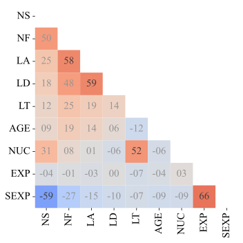
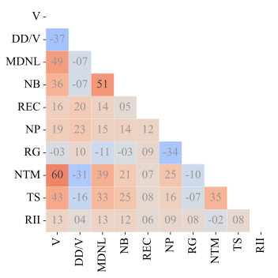

</details>


### RQ1: Do HCC metrics correlate with defect-inducing risk?

```bash
$ python scripts/pre_analysis.py plot-corr

$ python scripts/pre_analysis.py table-group-diff
```

<details>
<summary>(Click to see the RQ1 results)</summary>

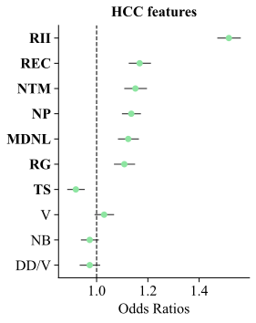
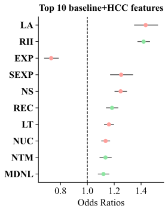
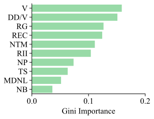
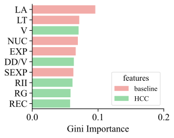

| Metric | Wilcoxon P-value | Cliff's Delta |
| ------ | ---------------- | ------------- |
| V      | 0.000            | small         |
| DD_V   | 0.042            | negligible    |
| MDNL   | 0.000            | small         |
| NB     | 0.000            | negligible    |
| REC    | 0.000            | negligible    |
| NP     | 0.000            | small         |
| RG     | 0.000            | negligible    |
| NTM    | 0.000            | negligible    |
| TS     | 0.000            | negligible    |
| RII    | 0.000            | small         |
</details>

### RQ2: How do HCC metrics differ from existing JIT-SDP metrics?

To reproduce the results of RQ2, run just-in-time software defect prediction (JIT-SDP) on the our dataset with the HCC metrics and the baseline metrics model.

```bash
$ python scripts/jit_sdp.py train-test --help

 Usage: jit_sdp.py train-test [OPTIONS] MODEL FEATURES

 Train and test the baseline/HCC/baseline+HCC model with 20 folds Just-In-Time Software Defect Prediction
 (JIT-SDP)

╭─ Arguments ──────────────────────────────────────────────────────────────────────────────────────────────╮
│ *    model         TEXT  Model to use: random_forest|xgboost [default: None] [required]                  │
│ *    features      TEXT  Feature set to use: baseline|HCC|baseline+HCC [default: None] [required]        │
╰──────────────────────────────────────────────────────────────────────────────────────────────────────────╯
╭─ Options ────────────────────────────────────────────────────────────────────────────────────────────────╮
│ --smote           --no-smote               Use SMOTE for oversampling [default: smote]                   │
│ --display         --no-display             Display progress bar [default: no-display]                    │
│ --baseline-dir                       PATH  Baseline data directory [default: data/dataset/baseline]      │
│ --hcc-dir                            PATH  HCC data directory [default: data/dataset/hcc]                │
│ --output-dir                         PATH  Output directory [default: data/output]                       │
│ --save-model      --no-save-model          Save models [default: no-save-model]                          │
│ --load-model      --no-load-model          Load models [default: no-load-model]                          │
│ --save-dir                           PATH  Save directory [default: data/pickles]                        │
╰──────────────────────────────────────────────────────────────────────────────────────────────────────────╯
```

In RQ2, we used the `random_forest` model with the `baseline`, `HCC` features, and applied the `SMOTE` technique for oversampling.

```bash
$ python scripts/jit_sdp.py train-test random_forest baseline   # --load-model for loading the trained models from `data/pickles`
$ python scripts/jit_sdp.py train-test random_forest hcc    # --save-model for saving the trained models to `data/pickles`
```

Then, to generate the set relationships between the HCC model and the baseline model,

```bash
$ python scripts/analysis.py plot-set-relationships --help

 Usage: analysis.py plot-set-relationships [OPTIONS] [BASELINE_JSON] [HCC_JSON]

 Generate plots for TPs predicted by baseline model only vs HCC model only

╭─ Arguments ─────────────────────────────────────────────────────────────────────────────────╮
│   baseline_json      [BASELINE_JSON]  [default: data/output/random_forest_baseline.json]    │
│   hcc_json           [HCC_JSON]       [default: data/output/random_forest_hcc.json]         │
╰─────────────────────────────────────────────────────────────────────────────────────────────╯
╭─ Options ───────────────────────────────────────────────────────────────────────────────────╮
│ --save-path        PATH  [default: data/plots/analysis/diff_plot.svg]                       │
╰─────────────────────────────────────────────────────────────────────────────────────────────╯
```

<details>
<summary>(Click to see the RQ2 results)</summary>
<h4>Correlations (left), Set relationships between TPs (right)</h4>

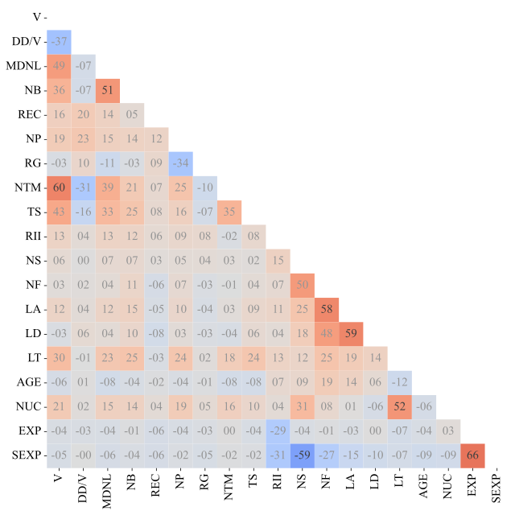
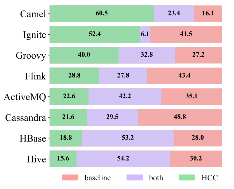

</details>

### RQ3: Can HCC metrics improve the performance of JIT-SDP models?

To reproduce the results of RQ3, run the RF and XGBoost models with the baseline and baseline+HCC features

```bash
$ python scripts/jit_sdp.py train-test random_forest baseline+hcc 
$ python scripts/jit_sdp.py train-test xgboost baseline 
$ python scripts/jit_sdp.py train-test xgboost baseline+hcc
```

Then, to generate the performance comparison radar charts between the baseline model and the baseline+HCC model,

```bash
$ python scripts/analysis.py plot-radars --help

 Usage: analysis.py plot-radars [OPTIONS] [RF_BASELINE] [RF_BASELINE_HCC]
                                [XGB_BASELINE] [XGB_BASELINE_HCC]

 Generate radar charts for performance comparison between models

╭─ Arguments ─────────────────────────────────────────────────────────────────────────────────────────╮
│   rf_baseline           [RF_BASELINE]       [default: data/output/random_forest_baseline.json]      │
│   rf_baseline_hcc       [RF_BASELINE_HCC]   [default: data/output/random_forest_baseline+hcc.json]  │
│   xgb_baseline          [XGB_BASELINE]      [default: data/output/xgboost_baseline.json]            │
│   xgb_baseline_hcc      [XGB_BASELINE_HCC]  [default: data/output/xgboost_baseline+hcc.json]        │
╰─────────────────────────────────────────────────────────────────────────────────────────────────────╯
╭─ Options ───────────────────────────────────────────────────────────────────────────────────────────╮
│ --save-dir        PATH  [default: data/plots/analysis]                                              │
╰─────────────────────────────────────────────────────────────────────────────────────────────────────╯
```

You can also generate the table version:

```bash
$ python scripts/analysis.py table-performances --help

 Usage: analysis.py table-performances [OPTIONS] JSON1 JSON2

 Generate table for performance comparison between models

╭─ Arguments ─────────────────────────────────────────────────────────────────────────────────────────╮
│ *    json1      PATH  [default: None] [required]                                                    │
│ *    json2      PATH  [default: None] [required]                                                    │
╰─────────────────────────────────────────────────────────────────────────────────────────────────────╯
╭─ Options ───────────────────────────────────────────────────────────────────────────────────────────╮
│ --fmt                    TEXT  [default: github]                                                    │
│ --quiet    --no-quiet          [default: no-quiet]                                                  │
╰─────────────────────────────────────────────────────────────────────────────────────────────────────╯
```

```bash
$ python scripts/analysis.py table-performances data/output/random_forest_baseline.json data/output/random_forest_baseline+hcc.json

$ python scripts/analysis.py table-performances data/output/xgboost_baseline.json data/output/xgboost_baseline+hcc.json
```

<details>
<summary>(Click to see the RQ3 results)</summary>
<h4>RF (f1, mcc, brier)</h4>

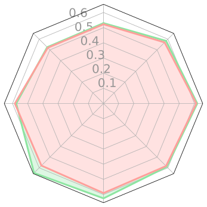
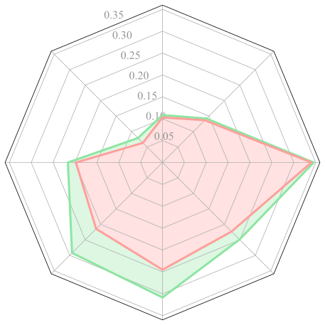
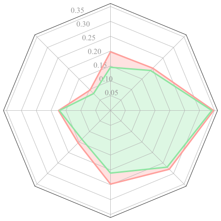
<p>red: baseline, green: baseline+HCC</p>
<h4>XGBoost (f1, mcc, brier)</h4>

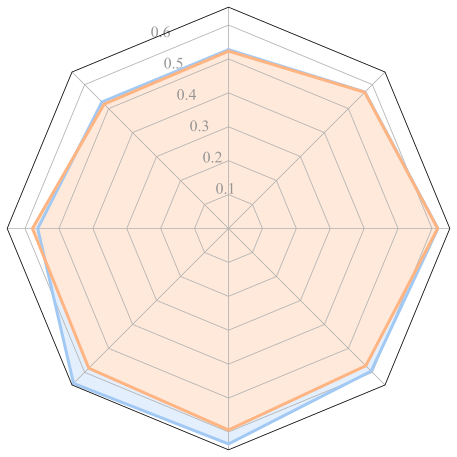

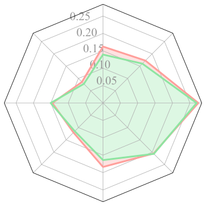
<p>orange: baseline, blue: baseline+HCC</p>

<h4>RF</h4>

| Project   | Features     | f1_macro       | mcc            | brier          |
| --------- | ------------ | -------------- | -------------- | -------------- |
| ActiveMQ  | baseline     | 0.54           | 0.10           | 0.19           |
|           | baseline+hcc | 0.55 0.245 [s] | 0.11 0.787 [*] | 0.12 0.000 [l] |
| Camel     | baseline     | 0.53           | 0.06           | 0.09           |
|           | baseline+hcc | 0.54 0.190 [s] | 0.08 0.239 [s] | 0.08 0.000 [l] |
| Flink     | baseline     | 0.60           | 0.20           | 0.16           |
|           | baseline+hcc | 0.60 0.372 [s] | 0.22 0.304 [s] | 0.14 0.267 [s] |
| Groovy    | baseline     | 0.61           | 0.21           | 0.14           |
|           | baseline+hcc | 0.64 0.001 [l] | 0.29 0.000 [l] | 0.14 0.330 [s] |
| Cassandra | baseline     | 0.62           | 0.25           | 0.24           |
|           | baseline+hcc | 0.65 0.000 [l] | 0.31 0.000 [l] | 0.20 0.000 [l] |
| HBase     | baseline     | 0.60           | 0.22           | 0.27           |
|           | baseline+hcc | 0.61 0.003 [l] | 0.25 0.000 [l] | 0.26 0.003 [l] |
| Hive      | baseline     | 0.64           | 0.34           | 0.34           |
|           | baseline+hcc | 0.64 0.685 [*] | 0.35 0.892 [*] | 0.34 0.978 [*] |
| Ignite    | baseline     | 0.57           | 0.14           | 0.20           |
|           | baseline+hcc | 0.56 0.705 [*] | 0.14 0.829 [*] | 0.18 0.004 [l] |

<h4>XGBoost</h4>

| Project   | Features     | f1_macro       | mcc            | brier          |
| --------- | ------------ | -------------- | -------------- | -------------- |
| ActiveMQ  | baseline     | 0.52           | 0.08           | 0.22           |
|           | baseline+hcc | 0.55 0.002 [l] | 0.10 0.267 [s] | 0.17 0.000 [l] |
| Camel     | baseline     | 0.52           | 0.05           | 0.09           |
|           | baseline+hcc | 0.53 0.144 [s] | 0.07 0.234 [s] | 0.08 0.004 [l] |
| Flink     | baseline     | 0.59           | 0.18           | 0.17           |
|           | baseline+hcc | 0.59 0.871 [*] | 0.18 0.871 [*] | 0.16 0.968 [*] |
| Groovy    | baseline     | 0.58           | 0.16           | 0.15           |
|           | baseline+hcc | 0.66 0.000 [l] | 0.31 0.000 [l] | 0.13 0.005 [l] |
| Cassandra | baseline     | 0.59           | 0.19           | 0.26           |
|           | baseline+hcc | 0.63 0.000 [l] | 0.25 0.000 [l] | 0.22 0.000 [l] |
| HBase     | baseline     | 0.59           | 0.20           | 0.27           |
|           | baseline+hcc | 0.59 0.978 [*] | 0.22 0.213 [s] | 0.28 0.014 [m] |
| Hive      | baseline     | 0.61           | 0.30           | 0.37           |
|           | baseline+hcc | 0.62 0.088 [s] | 0.32 0.070 [m] | 0.36 0.050 [m] |
| Ignite    | baseline     | 0.55           | 0.12           | 0.20           |
|           | baseline+hcc | 0.56 0.213 [s] | 0.14 0.048 [m] | 0.18 0.042 [m] |
</details>

### Discussion: More Actionable JIT-SDP with HCC metrics

To generate the actionable JIT-SDP results,

```bash
 Usage: jit_sdp.py actionable [OPTIONS] MODEL

 Compute the ratios of actionable features for the baseline and baseline+HCC models for the true
 positive samples in the 20 folds JIT-SDP

╭─ Arguments ─────────────────────────────────────────────────────────────────────────────────────────╮
│ *    model      TEXT  Model to use: random_forest|xgboost [default: None] [required]                │
╰─────────────────────────────────────────────────────────────────────────────────────────────────────╯
╭─ Options ────────────────────────────────────────────────────────────────────────────────────────────╮
│ --smote           --no-smote               Use SMOTE for oversampling [default: smote]               │
│ --display         --no-display             Display progress bar [default: no-display]                │
│ --baseline-dir                       PATH  Baseline data directory [default: data/dataset/baseline]  │
│ --hcc-dir                            PATH  HCC data directory [default: data/dataset/hcc]            │
│ --output-dir                         PATH  Output directory [default: data/output]                   │
│ --load-model      --no-load-model          Load models [default: no-load-model]                      │
│ --pickles-dir                        PATH  Pickles directory [default: data/pickles]                 │
╰──────────────────────────────────────────────────────────────────────────────────────────────────────╯
```

Then, to tabulate the results,

```bash
$ python scripts/analysis.py table-actionable --help

 Usage: analysis.py table-actionable [OPTIONS] [PATH]

 Tabulate the results of the actionable features

╭─ Arguments ──────────────────────────────────────────────────╮
│   path      [PATH]  [default: data/output/actionable.csv]    │
╰──────────────────────────────────────────────────────────────╯
╭─ Options ────────────────────────────────────────────────────╮
│ --fmt         TEXT  [default: github]                        │
╰──────────────────────────────────────────────────────────────╯
```

<details>
<summary>(Click to see the discussion results)</summary>

| Project   | baseline+HCC | baseline | Wilcoxon, Cliff's Delta |
| --------- | ------------ | -------- | ----------------------- |
| activemq  | 66.1         | 65.8     | 0.883 [*]               |
| camel     | 67.4         | 65.9     | 0.444 [*]               |
| flink     | 73.5         | 68.4     | 0.000 [s]               |
| groovy    | 66.4         | 49.7     | 0.000 [l]               |
| cassandra | 74.7         | 58.8     | 0.000 [l]               |
| hbase     | 79.0         | 71.1     | 0.000 [s]               |
| hive      | 82.0         | 75.8     | 0.000 [s]               |
| ignite    | 77.1         | 65.9     | 0.000 [m]               |
| Average   | 73.3         | 65.2     |                         |

</details>
