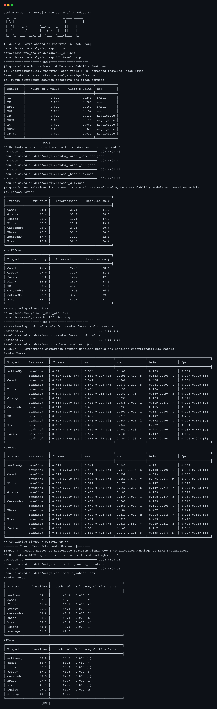

# NeuroJIT Replication Package

This document introduces the replication package for *NeuroJIT: Improving Just-In-Time Defect Prediction Using Neurophysiological and Empirical Perceptions of Modern Developers* (NeuroJIT) and provides detailed instructions on how to use it. The package includes core modules of NeuroJIT as well as scripts and datasets necessary to replicate the results presented in the paper. You can use this package to replicate the paper’s results or implement a customized version of NeuroJIT to conduct experiments that meet your needs. If you have any questions about the package or the content of the paper, please feel free to contact us via email at [fantasyopy@hanyang.ac.kr](mailto:fantasyopy@hanyang.ac.kr) or [sparky@hanyang.ac.kr](mailto:sparky@hanyang.ac.kr). Thank you!

## License

This project is licensed under the Apache License 2.0 - see the [LICENSE](LICENSE) file for details.

## Contents

- [1. Brief Descriptions of the Replication Package](#1-brief-descriptions-of-a-package)
  - [Structure of the Replication Package](#Structure-of-the-Replication-Package)
  - [Dataset](#Dataset)
  - [NeuroJIT](#NeuroJIT)
- [2. Step-by-step Explanations for NeuroJIT Replication](#1-step-by-step-explanations-for-neurojit-replication)
  - [2-1. Setup](#21-setup)
    - [1) Hardware/Software Requirements](#1-hardwaresoftware-requirements)
    - [2) Docker Container Setup](#2-docker-container-setup)
  - [2-2. Usage](#22-usage)
    - [1) Reproducing the Experimental Results](#1-reproducing-the-experimental-results)
    - [2) Additional Experiments for the Validity](#2-additional-experiments-for-the-validity)
    - [3) An Example Usage of NeuroJIT](#3-an-example-usage-of-neurojit)
- [3. Customizing NeuroJIT](#2-customizing-neurojit)

## 1. Brief Descriptions of a Package

### Structure

The structure of the package is as follows:

```Shell
├── archive # zipped trained models (pickles) in our experiment
├── data
│  ├── dataset # dataset used in the experiments
│  ├── output # output of the experiments
│  └── plots  # plots generated in the experiments
├── dist # neurojit package distribution
├── Dockerfile
├── docker-compose.yml
├── src/neurojit # core module
└── scripts 
# main scripts
   ├── data_utils.py # data preprocessing and caching
   ├── calculate.py # calculate commit understandability features and LT of Kamei et al.
   ├── pre_analysis.py # analyze statistics of the dataset
   ├── jit_sdp.py # machine learning algorithm training and evaluation for just-in-time defect prediction
   ├── analysis.py # analyze the ML models
# sub-modules
   ├── correlation.py # modules for correlation analysis
   ├── environment.py # environment variables for main scripts
   ├── visualization.py # visualization tools
# for replication
   ├── reproduce.sh # a script to reproduce the major experimental results of the paper
   ├── commit_distribution.ipynb # a notebook for commit distribution analysis (external validity)
   └── neurojit_cli.py # an example of utilizing NeuroJIT for user's objectives
```

### Dataset

The ApacheJIT-based dataset includes widely adopted just-in-time defect prediction features and the commit understandability features of NeuroJIT from a total of eight Apache projects. Each CSV file in the `data/dataset` directory represents intermediate outputs generated at each experimental stage described in the paper, while each CSV file in the combined/ directory represents the final output per project.

```Shell
data/dataset
├── apachejit_total.csv # original ApacheJIT dataset
├── apachejit_date.csv # ApacheJIT dataset with bug_fix_date
├── apachejit_gap.csv # gap between commit date and bug_fix_date in ApacheJIT dataset
├── apache_metrics_kamei.csv # traditional just-in-time features in ApacheJIT dataset
├── baseline/  # LT added and preprocessed ApacheJIT dataset
│  ├── activemq.csv
│  ├── ...
├── combined/*.csv   # the dataset used in the research
└── cuf/*.csv      # 9 commit understandability features of target commits
```

If you wish to build the dataset from scratch, you can use the following scripts:

```Shell
 (1) Usage: python scripts/data_utils.py COMMAND [ARGS]...

 Data preprocessing and caching

╭─ Commands ────────────────────────────────────────────────────────────────────────────────────────────────────────────────────╮
│ combine-dataset   Combine the baseline and CUF datasets                                                                       │
│ filter-commits    Filter method changes for each commit in the dataset and save methods to cache                              │
│ prepare-data      ApacheJIT(+bug_date column) dataset                                                                         │
│ save-methods      Save the change contexts for commits that modified existing methods                                         │
╰───────────────────────────────────────────────────────────────────────────────────────────────────────────────────────────────╯

 (2) Usage: python scripts/calculate.py COMMAND [ARGS]...

 Calculate metrics for CUF and Baseline

╭─ Commands ────────────────────────────────────────────────────────────────────────────────────────────────────────────────────╮
│ cuf-all       Calculate all CUF for a project                                                                                 │
│ cuf-metrics   Calculate specific CUF metrics for a project                                                                    │
│ lt            Calculate LT for apachejit_metrics(baseline)                                                                    │
╰───────────────────────────────────────────────────────────────────────────────────────────────────────────────────────────────╯
```

Building the dataset from scratch takes considerable time because it requires comparing all methods in each commit for `filter-commits` and invoking Checkstyle for each file in the commit when calculating commit understandability features. Therefore, we provide the pre-built datasets in the data/dataset directory.

### NeuroJIT

The `neurojit` module provides commit understandability features calculation, a core feature of NeuroJIT, and the implementation of the JIT-SDP data splitting method. The module has the following structure:

```Shell
src/neurojit
├── commit.py # commit filtering and saving
├── cuf
│  ├── cfg.py # control flow graph
│  ├── halstead.py # halstead metrics
│  ├── metrics.py  # CUF calculation (method and commit level)
│  └── rii.py # II feature calculation using Checkstyle
└── tools
    └── data_utils.py # JIT-SDP data split utility (chronological order, verification latency, concept drifts)
```

## 2. Step-by-step Explanations for NeuroJIT Replication
### 2-1. Setup

#### 1) Hardware/Software Requirements

We tested the replication package on the following devices:

 - Windows 11
   - CPU: AMD Ryzen 5 5600X
   - RAM: 32GB
 - Ubuntu 20.04.6
   - Device: NVIDIA DGX Station V100, 2019
   - CPU: Intel Xeon(R) E5-2698 v4 @ 2.20GHz
   - RAM: 256GB
 - MacOS 14.6.1
   - Device: MacBook Air M2, 2022
   - CPU: Apple M2
   - RAM: 24GB
 - Docker version 4.33.1
  
#### 2) Docker Container Setup

To install Docker, refer to the official installation guide at [https://docs.docker.com/get-docker/](https://docs.docker.com/get-docker/). 
After downloading and extracting `NeuroJIT.zip`, navigate to the directory via CLI. 
To build the container using Docker Compose, execute the following command:

```Shell
$ docker-compose up --build -d
...
✔ Container neurojit-ase  Started
```

Verify that the `neurojit-ase` container is running by using the `docker ps` command.

### 2-2. Usage

#### 1) Reproducing the Experimental Results

To reproduce the main results of the paper, run the following command:

```Shell
$ docker exec -it neurojit-ase scripts/reproduce.sh
``` 

If the script executes successfully, you should see the following results:



In addition to the tables shown in the capture, you can find the figures in the saved directory.

For a detailed explanation of reproduce.sh, please refer to `reproduce_sh.md`.

#### 2) Additional Experiments for the Validity

1) The conclusion presented in Figure 5 on page 7 of the paper, which shows that commit understandability features provide exclusive information, holds true for all positives, not just true positives. You can confirm the results for all positives by executing the following commands with the `--no-only-tp` option:

    ```Shell
    $ docker exec -it neurojit-ase python scripts/analysis.py table-set-relationships data/output/random_forest_cuf.json data/output/random_forest_baseline.json --fmt fancy_outline --no-only-tp

    ╒═══════════╤════════════╤════════════════╤═════════════════╕
    │ Project   │   cuf only │   Intersection │   baseline only │
    ╞═══════════╪════════════╪════════════════╪═════════════════╡
    │ Groovy    │       58.2 │           15.7 │            26.1 │
    │ Camel     │       53.7 │           17.9 │            28.4 │
    │ Flink     │       47.1 │           13.4 │            39.5 │
    │ Ignite    │       41.9 │           10.2 │            47.9 │
    │ Cassandra │       33.8 │           17.2 │            48.9 │
    │ HBase     │       31.4 │           35.6 │            33.0 │
    │ ActiveMQ  │       30.3 │           14.7 │            54.9 │
    │ Hive      │       29.8 │           40.3 │            29.9 │
    ╘═══════════╧════════════╧════════════════╧═════════════════╛

    $ docker exec -it neurojit-ase python scripts/analysis.py table-set-relationships data/output/xgboost_cuf.json data/output/xgboost_baseline.json --fmt fancy_outline --no-only-tp

    ╒═══════════╤════════════╤════════════════╤═════════════════╕
    │ Project   │   cuf only │   Intersection │   baseline only │
    ╞═══════════╪════════════╪════════════════╪═════════════════╡
    │ Groovy    │       60.2 │           15.9 │            23.9 │
    │ Camel     │       57.2 │           17.0 │            25.8 │
    │ Flink     │       49.3 │           13.0 │            37.7 │
    │ Ignite    │       45.0 │           10.1 │            44.9 │
    │ Cassandra │       40.4 │           18.2 │            41.4 │
    │ HBase     │       39.8 │           31.6 │            28.6 │
    │ ActiveMQ  │       34.9 │           16.0 │            49.1 │
    │ Hive      │       29.2 │           37.9 │            32.9 │
    ╘═══════════╧════════════╧════════════════╧═════════════════╛
    ```
2) To obtain the results mentioned in the External Validity section on page 10 of the paper, which states that the dataset used in this study shows a different distribution compared to the dataset used in previous studies, execute the following commands:
  
    ```Shell
    $ docker exec -it neurojit-ase python scripts/pre_analysis.py plot-commit-distribution --ours

    Saved plot to data/plots/commit_distribution_ours.png

    $ docker exec -it neurojit-ase python scripts/pre_analysis.py plot-commit-distribution

    Saved plot to data/plots/commit_distribution_apachejit.png
    ```

    Check the figures saved in the corresponding directory.

#### 3) An Example Usage of NeuroJIT

NeuroJIT is designed to calculate commit understandability features from any project’s commits. You can calculate the features using the following `neurojit_cli.py` script:

```Shell
$ docker exec -it neurojit-ase python scripts/neurojit_cli.py calculate --project REPONAME --commit-hash COMMIT_HASH
```

For example, to calculate the features for the `8f40a7` commit in the `ActiveMQ` project, run the following command:

```Shell
$ docker exec -it neurojit-ase python scripts/neurojit_cli.py calculate --project activemq --commit-hash 8f40a7

{'NOGV': 1.0, 'MDNL': 0.0, 'TE': 3.5122864969277017, 'II': 0.03225806451612903, 'NOP': 0.0, 'NB': 0.0, 'EC': 0.5, 'DD_HV': 0.04324106779539902, 'NOMT': 9.0}
```

If the commit is not a method changes commit, you will see a message like this:

```Shell
$ docker exec -it neurojit-ase python scripts/neurojit_cli.py calculate --project groovy --commit-hash 7b84807

Target commit is not a method changes commit
```

You can calculate the features in any project you desire, even if it is not one of the Apache projects included in the experiments of the paper. For example, to calculate the features from the `0101945` commit in the `spring-projects/spring-framework` project, run the following command:

```Shell
$ docker exec -it neurojit-ase python scripts/neurojit_cli.py calculate --project spring-projects/spring-framework --commit-hash 0101945

{'NOGV': 0.6, 'MDNL': 0.0, 'TE': 4.623781958476344, 'II': 0.9166666666666666, 'NOP': 1.0, 'NB': 0.0, 'EC': 0.3333333333333333, 'DD_HV': 0.04484876484351509, 'NOMT': 17.0}
```

## 3. Customizing NeuroJIT

To modify NeuroJIT and perform custom experiments, you can extend or modify the neurojit module by referring to the scripts described so far. Here are some examples of the code you can reference for module extensions:

- `neurojit.commit.py`: The function `Mining.only_method_changes(repo, commit_hash)` filters commits that only modify methods and saves the method bodies to the cache. You can modify this function to use other filtering methods.
- `neurojit.cuf.metrics.py`: The `MethodUnderstandabilityFeatures` class calculates commit understandability features at the method level, and the `CommitUnderstandabilityFeatures` class calculates features for each method in the commit. You can modify these classes to add new features or change existing features.
- `scripts/environment.py`: This script includes the environment variables used in the scripts. Modify the environment variables to perform custom experiments.
