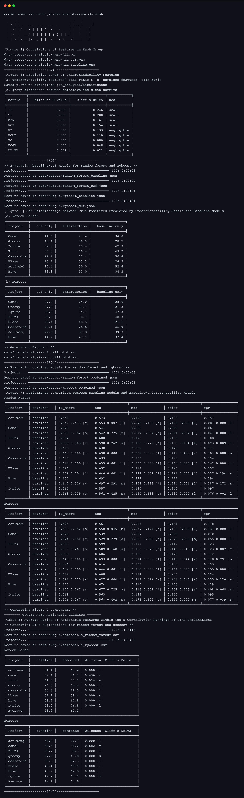

# NeuroJIT Replication Package

본 문서는 *NeuroJIT: Improving Just-In-Time Defect Prediction Using Neurophysiological and Empirical Perceptions of Modern Developers*(NeuroJIT)의 복제 패키지를 소개하고 그 사용 방법을 자세히 설명합니다. 이 패키지는 NeuroJIT의 핵심 모듈과 논문의 결과를 재현하기 위한 스크립트 및 데이터셋을 포함합니다. 여러분은 이 패키지를 사용해 논문의 결과를 재현하거나 customized NeuroJIT을 구현해 필요한 실험을 수행할 수 있습니다. 패키지 및 본문에 관한 질문이 있으시면 언제든지 [fantasyopy@hanyang.ac.kr](mailto:fantasyopy@hanyang.ac.kr) 또는 [sparky@hanyang.ac.kr](mailto:sparky@hanyang.ac.kr)로 이메일을 통해 연락해 주세요. 감사합니다!

## License

This project is licensed under the Apache License 2.0 - see the [LICENSE](LICENSE) file for details.

## Contents

[0. Brief Descriptions of a Package](#0-brief-descriptions-of-a-package)  
[1. Step-by-step Explanations for NeuroJIT Replication](#1-step-by-step-explanations-for-neurojit-replication)  
[2. Customizing NeuroJIT](#2-customizing-neurojit)


## 0. Brief Descriptions of a Package

### 0.1. Structure of the Replication Package

복제 패키지의 구조는 다음과 같습니다:

```Shell
├── archive # zipped trained models (pickles) in our experiment
├── data
│  ├── dataset # dataset used in the experiments
│  ├── output # output of the experiments
│  └── plots  # plots generated in the experiments
├── dist # neurojit package distribution
├── Dockerfile
├── docker-compose.yml
├── src/neurojit # core module
└── scripts 
# main scripts
   ├── data_utils.py # data preprocessing and caching
   ├── calculate.py # calculate commit understandability features and LT of Kamei et al.
   ├── pre_analysis.py # analyze statistics of the dataset
   ├── jit_sdp.py # machine learning algorithm training and evaluation for just-in-time defect prediction
   ├── analysis.py # analyze the ML models
# sub-modules
   ├── correlation.py # modules for correlation analysis
   ├── environment.py # environment variables for main scripts
   ├── visualization.py # visualization tools
# for replication
   ├── reproduce.sh # a script to reproduce the major experimental results of the paper
   ├── commit_distribution.ipynb # a notebook for commit distribution analysis (external validity)
   └── neurojit_cli.py # an example of utilizing NeuroJIT for user's objectives
```

### 0.2. Dataset:

Apache JIT 기반의 데이터셋(`combined/`)은 총 8개의 Apache 프로젝트들의 widely adopted just-in-time defect prediction features와 NeuroJIT의 commit understandability features를 포함합니다. `data/dataset` 속 각 csv 파일은 논문에서 설명한 각 실험 단계에 따라 생성된 중간 산출물이며, `combined/` 속 각 csv 파일은 프로젝트 별 최종 산출물입니다.

```Shell
data/dataset
├── apachejit_total.csv # original ApacheJIT dataset
├── apachejit_date.csv # ApacheJIT dataset with bug_fix_date
├── apachejit_gap.csv # gap between commit date and bug_fix_date in ApacheJIT dataset
├── apache_metrics_kamei.csv # traditional just-in-time features in ApacheJIT dataset
├── baseline/  # LT added and preprocessed ApacheJIT dataset
│  ├── activemq.csv
│  ├── ...
├── combined/*.csv   # the dataset used in the research
└── cuf/*.csv      # 9 commit understandability features of target commits
```

만약, 데이터셋을 처음부터 구축하길 원한다면 다음 스크립트들을 사용할 수 있습니다:

```Shell
 (1) Usage: python scripts/data_utils.py COMMAND [ARGS]...

 Data preprocessing and caching

╭─ Commands ────────────────────────────────────────────────────────────────────────────────────────────────────────────────────╮
│ combine-dataset   Combine the baseline and CUF datasets                                                                       │
│ filter-commits    Filter method changes for each commit in the dataset and save methods to cache                              │
│ prepare-data      ApacheJIT(+bug_date column) dataset                                                                         │
│ save-methods      Save the change contexts for commits that modified existing methods                                         │
╰───────────────────────────────────────────────────────────────────────────────────────────────────────────────────────────────╯

 (2) Usage: python scripts/calculate.py COMMAND [ARGS]...

 Calculate metrics for CUF and Baseline

╭─ Commands ────────────────────────────────────────────────────────────────────────────────────────────────────────────────────╮
│ cuf-all       Calculate all CUF for a project                                                                                 │
│ cuf-metrics   Calculate specific CUF metrics for a project                                                                    │
│ lt            Calculate LT for apachejit_metrics(baseline)                                                                    │
╰───────────────────────────────────────────────────────────────────────────────────────────────────────────────────────────────╯
```

데이터를 처음부터 구축하는 데는 시간이 상당히 오래 걸리는데, 그 이유는 `filter-commits`를 위해 각 커밋의 모든 메서드를 비교해야 하며, CUF 계산 시 커밋의 각 파일에 대해 Checkstyle을 호출해야 하기 때문입니다. 따라서 우리는 [data/dataset](data/dataset/) 디렉터리에 미리 구축된 데이터셋을 제공합니다.

### 0.3. neurojit: 

`neurojit` 모듈은 NeuroJIT의 핵심 기능인 CUF 계산, JIT-SDP 데이터 분할 방법 구현을 제공합니다. 모듈은 다음과 같은 구조로 구성되어 있습니다:

```Shell
src/neurojit
├── commit.py # commit filtering and saving
├── cuf
│  ├── cfg.py # control flow graph
│  ├── halstead.py # halstead metrics
│  ├── metrics.py  # CUF calculation (method and commit level)
│  └── rii.py # II feature calculation using Checkstyle
└── tools
    └── data_utils.py # JIT-SDP data split utility (chronological order, verification latency, concept drifts)
```
## 1. Step-by-step Explanations for NeuroJIT Replication
### 1.1. Setup

#### 1) Hardware/Software Requirements

우리는 다음 사양의 장치들에서 복제 패키지를 테스트했습니다.

 - Windows 11
   - CPU: AMD Ryzen 5 5600X
   - RAM: 32GB
 - Ubuntu 20.04.6
   - Device: NVIDIA DGX Station V100, 2019
   - CPU: Intel Xeon(R) E5-2698 v4 @ 2.20GHz
   - RAM: 256GB
 - MacOS 14.6.1
   - Device: MacBook Air M2, 2022
   - CPU: Apple M2
   - RAM: 24GB
 - Docker version 4.33.1
  
#### 2) Docker Container Setup

Docker를 설치하려면 [https://docs.docker.com/get-docker/](https://docs.docker.com/get-docker/)에서 공식 설치 가이드를 참조하세요.
NeuroJIT.zip를 다운로드 및 압축해제한 후 CLI에서 해당 디렉토리로 이동하세요.
Docker Compose를 사용하여 컨테이너를 빌드하기 위해 다음 명령을 실행하세요:

```Shell
$ docker-compose up --build -d
...
✔ Container neurojit-ase  Started
```
`docker ps`를 통해 `neurojit-ase` 컨테이너가 실행 중인지 확인하세요.

### 1.2. Usage

#### 1) Reproducing the Experimental Results

논문의 주요한 결과들을 재현하려면 다음 명령을 실행하세요:

```Shell
$ docker exec -it neurojit-ase scripts/reproduce.sh
``` 

스크립트가 성공적으로 실행되면 다음과 같은 결과를 얻을 수 있습니다:


캡쳐에 표시된 테이블들 외에 figures는 저장된 디렉토리에서 확인할 수 있습니다.

또한, reproduce.sh에 대한 자세한 설명은 `reproduce_sh.md`에서 확인할 수 있습니다.

#### 2) Additional Experiments for the Validity

1) Commit understandability features가 exclusive information을 제공하는 것을 보여주는 논문의 7페이지의 Figure 5는 true positives뿐만 아니라 모든 positives에 대해서도 결론이 동일하게 나타납니다. `--no-only-tp` 옵션을 사용하여 다음의 명령들을 실행하면면 모든 positives에 대한 결과를 확인할 수 있습니다:

    ```Shell
    $ docker exec -it neurojit-ase python scripts/analysis.py table-set-relationships data/output/random_forest_cuf.json data/output/random_forest_baseline.json --fmt fancy_outline --no-only-tp

    ╒═══════════╤════════════╤════════════════╤═════════════════╕
    │ Project   │   cuf only │   Intersection │   baseline only │
    ╞═══════════╪════════════╪════════════════╪═════════════════╡
    │ Groovy    │       58.2 │           15.7 │            26.1 │
    │ Camel     │       53.7 │           17.9 │            28.4 │
    │ Flink     │       47.1 │           13.4 │            39.5 │
    │ Ignite    │       41.9 │           10.2 │            47.9 │
    │ Cassandra │       33.8 │           17.2 │            48.9 │
    │ HBase     │       31.4 │           35.6 │            33.0 │
    │ ActiveMQ  │       30.3 │           14.7 │            54.9 │
    │ Hive      │       29.8 │           40.3 │            29.9 │
    ╘═══════════╧════════════╧════════════════╧═════════════════╛

    $ docker exec -it neurojit-ase python scripts/analysis.py table-set-relationships data/output/xgboost_cuf.json data/output/xgboost_baseline.json --fmt fancy_outline --no-only-tp

    ╒═══════════╤════════════╤════════════════╤═════════════════╕
    │ Project   │   cuf only │   Intersection │   baseline only │
    ╞═══════════╪════════════╪════════════════╪═════════════════╡
    │ Groovy    │       60.2 │           15.9 │            23.9 │
    │ Camel     │       57.2 │           17.0 │            25.8 │
    │ Flink     │       49.3 │           13.0 │            37.7 │
    │ Ignite    │       45.0 │           10.1 │            44.9 │
    │ Cassandra │       40.4 │           18.2 │            41.4 │
    │ HBase     │       39.8 │           31.6 │            28.6 │
    │ ActiveMQ  │       34.9 │           16.0 │            49.1 │
    │ Hive      │       29.2 │           37.9 │            32.9 │
    ╘═══════════╧════════════╧════════════════╧═════════════════╛
    ```
2) 논문 10페이지의 External Validity 섹션에서 언급된 연구의 데이터셋과 본 연구의 데이터셋이 다른 분포를 보인다는 결과는 다음의 명령들을 실행하면 얻을 수 있습니다:

해당 디렉토리에 저장된 figures를 확인해주세요.

#### 3) An Example Usage of NeuroJIT

NeuroJIT은 어떤 프로젝트의 커밋에서든지간에 commit understandability features를 계산할 수 있도록 설계되었습니다. 
다음의 `neurojit_cli.py` 스크립트를 사용하여 the features를 계산할 수 있습니다:

```Shell
$ docker exec -it neurojit-ase python scripts/neurojit_cli.py calculate --project REPONAME --commit-hash COMMIT_HASH
```

예를 들어, `activemq` 프로젝트의 `8f40a7` 커밋에서 the features를 계산하려면 다음의 명령을 실행하세요:

```Shell
$ docker exec -it neurojit-ase python scripts/neurojit_cli.py calculate --project activemq --commit-hash 8f40a7

{'NOGV': 1.0, 'MDNL': 0.0, 'TE': 3.5122864969277017, 'II': 0.03225806451612903, 'NOP': 0.0, 'NB': 0.0, 'EC': 0.5, 'DD_HV': 0.04324106779539902, 'NOMT': 9.0}
```

메소드만 변경하는 커밋이 아닌 경우 다음과 같은 메시지가 출력됩니다:

```Shell
$ docker exec -it neurojit-ase python scripts/neurojit_cli.py calculate --project groovy --commit-hash 7b84807

Target commit is not a method changes commit
```

논문의 실험에 포함된 Apache 프로젝트가 아니어도 사용자가 원하는 프로젝트에서 the features를 계산할 수 있습니다. 예를 들어, `spring-projects/spring-framework` 프로젝트의 `0101945` 커밋으로부터 the features를 계산하려면 다음의 명령을 실행하세요:

```Shell
$ docker exec -it neurojit-ase python scripts/neurojit_cli.py calculate --project spring-projects/spring-framework --commit-hash 0101945

{'NOGV': 0.6, 'MDNL': 0.0, 'TE': 4.623781958476344, 'II': 0.9166666666666666, 'NOP': 1.0, 'NB': 0.0, 'EC': 0.3333333333333333, 'DD_HV': 0.04484876484351509, 'NOMT': 17.0}
```

## 2. Customizing NeuroJIT

NeuroJIT을 변형하여 사용자 정의 실험을 수행하려면 지금까지 기술한 스크립트들을 참조하여 `neurojit` 모듈을 확장하거나 수정할 수 있습니다. 모듈 확장을 위해 참조할 수 있는 코드들은 다음과 같습니다:

- `neurojit.commit.py`: `Mining.only_method_changes(repo, commit_hash)`은 메소드만 수정하는 커밋을 필터링하고, 메소드 바디를 캐시에 저장합니다. 이 함수를 수정하여 다른 필터링 방법을 사용할 수 있습니다.
- `neurojit.cuf.metrics.py`: `MethodUnderstandabilityFeatures` 클래스는 메소드 수준에서 commit understandability features를 계산하고, `CommitUnderstandabilityFeatures` 클래스는 커밋 속 각 메서드 별로 the features를 계산합니다. 사용자는 각 클래스를 수정하여 새로운 feature를 추가하거나 기존 features를 변경할 수 있습니다.
- `scripts/environment.py`: 스크립트에서 사용되는 환경 변수들을 포함합니다. 환경 변수들을 수정하여 사용자 정의 실험을 수행할 수 있습니다.
